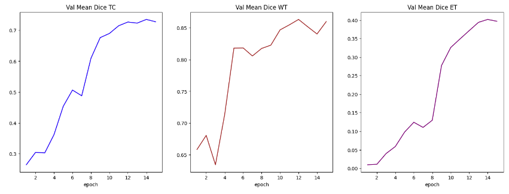
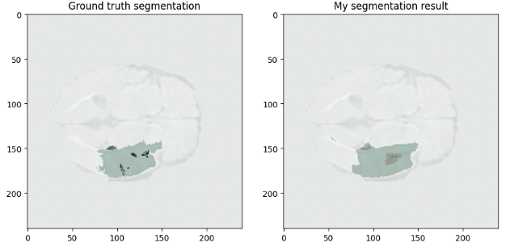

### Introduction
---
This repository is segmentation of braTS dataset. BraTS dataset is a benchmark for the segmentation of brain timors in multimodal magnetic resonance imaging(MRI) scans. BraTS utilizes multi-institutional pre-operative MRI scans and primarily focuses on the segmenation of brain tumors. 

To segment the tumor in brain, I used 3D Unet, a network for volumetric segmneation that learns from sparsely annotated volumetric images. The network learns from these sparse annotations and provides a dense 3D segmentation. Trained on this data set, the network densely segments new volumetric images. 


### Pre-processing
---
Processed the dataset by merging the labels to generate TC (Tumor core),WT (Whole tumor) and ET(Enhancing tumor) dataset. 

```
class ConvertToMultiChannelBasedOnBratsClassesd(MapTransform):
    def __call__(self, data):
        d = dict(data)
        for key in self.keys:
            result = []
            # merge label 2 and label 3 to construct TC
            result.append(torch.logical_or(d[key] == 2, d[key] == 3))
            # merge labels 1, 2 and 3 to construct WT
            result.append(torch.logical_or(torch.logical_or(d[key] == 2, d[key] == 3), d[key] == 1))
            # label 2 is ET
            result.append(d[key] == 2)
            d[key] = torch.stack(result, axis=0).float()
        return d
```

### Training 
---
For the training, I used [monai](https://monai.io/) and [MedPy](https://loli.github.io/medpy/) libraries. For the accurate results, I used 5-fold cross validations. 
[](https://github.com/hamny88/3DUnetBraTS/blob/master/BraTS_3D_Unet_ipynb.ipynb]


* Loss function: DiceLoss
* Optimizer: Adam 
* Learning schedule: CosineAnnealingLR
* Metric: Dice Mean, Housdorff distance 


### Results
---


These are the segmentation results 


* Metric on original image spacing: 0.7139434218406677
* metric on TC: 0.7663
* metric on WT: 0.8861
* metric on ET: 0.4895

Need more training for good accuracy.